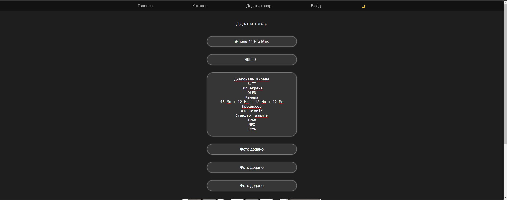
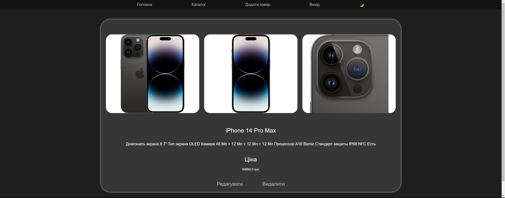
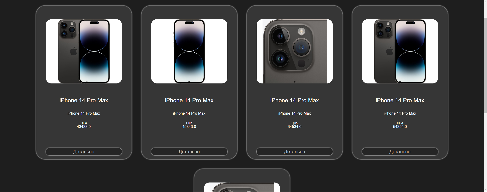

# Android Game Alias 

# SpringBoot WebStore
# CRUD App на Spring Boot

Цей проект реалізує простий CRUD-додаток на **Spring Boot** для керування даними. Додаток підтримує операції створення, читання, оновлення та видалення записів.

## 🚀 Функціонал

- 📋 **Перегляд записів**
- 🆕 **Створення нового запису**
- ✏️ **Редагування запису**
- 🗑️ **Видалення запису**

## 🛠 Технології

- **Backend**: Spring Boot, Java, Spring Data JPA
- **База даних**: H2 (або PostgreSQL)

## 📸 Скріншоти

1.  
   

2.  
   

3.  
   

4.  
   

5.  
   

6.  
   

7.  
   

8.  
   

9.  
   

10.  
   
