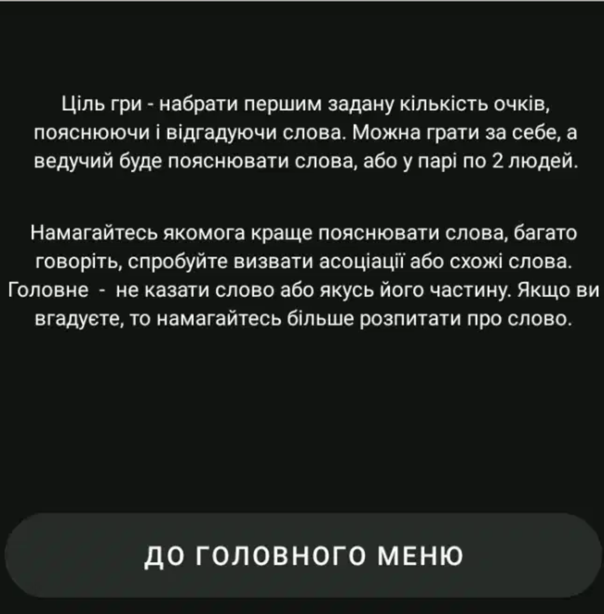
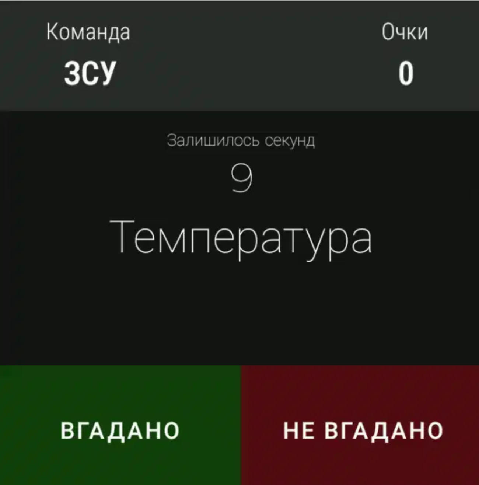
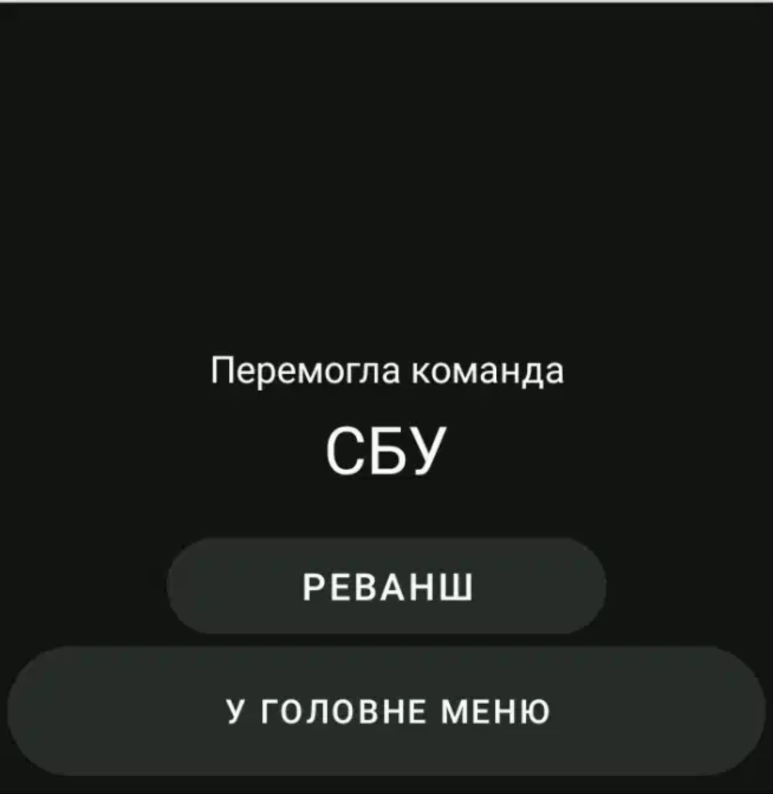
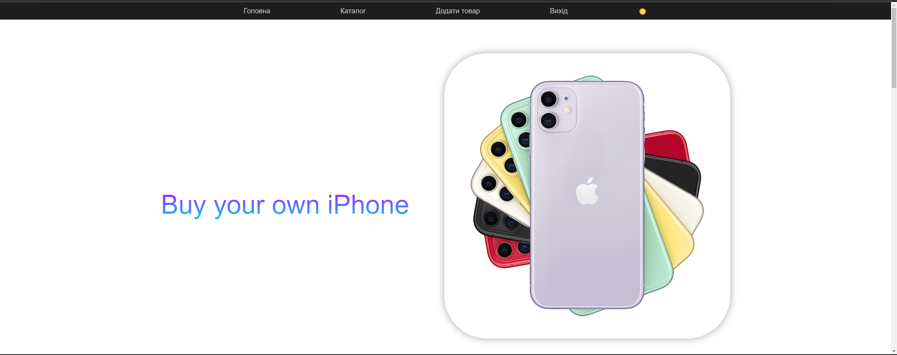

# Java Android Studio Game Alias 

## 📸 Скріншоти

   
   
   
   
   
   
   
   
   
   
   
   
   
   
   

# CRUD App на Spring Boot
Цей проект реалізує простий CRUD-додаток на **Spring Boot** для керування даними. Додаток підтримує операції створення, читання, оновлення та видалення записів.

## 🚀 Функціонал

- 📋 **Перегляд записів**
- 🆕 **Створення нового запису**
- ✏️ **Редагування запису**
- 🗑️ **Видалення запису**

## 🛠 Технології

- **Backend**: Spring Boot, Java, Spring Data JPA
- **База даних**: H2 (або PostgreSQL)

## 📸 Скріншоти для Spring Boot CRUD

   
   
   
   
   
   
   
   
   
   
   
   
   
   
   
   
   
   
   
